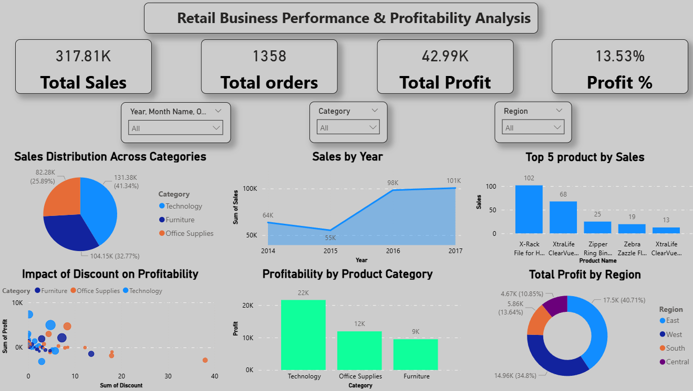
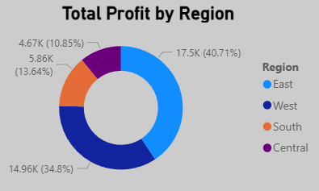
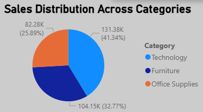

# **Retail Business Performance & Profitability Analysis**

## **Project Overview**

This project analyzes retail business data using Power BI to identify sales trends, profitability patterns, regional performance, and customer behavior.

The workflow included data cleaning and transformation using Power Query followed by interactive dashboard creation and KPI visualization in Power BI.

## **Tools & Technologies**

* Power BI  
* Power Query  
* Pandas  
* Excel

## **Key Tasks Performed**

* Imported and transformed raw business data  
* Cleaned inconsistent and missing values  
* Built KPI dashboards and visual reports  
* Analyzed sales and profitability trends  
* Performed basic exploratory analysis using Pandas

## **KPIs Tracked**

* Total Sales  
* Total Profit  
* Profit Percentage  
* Total Orders  
* Regional Performance  
* Product Category Performance

## **Key Insights**

* High discounting negatively affected profitability in several regions  
* Technology products generated stronger revenue contribution  
* Regional sales and profit performance varied significantly  
* Dashboard visualizations helped identify important business trends and patterns

## **Dashboard Preview**

### **Main Dashboard**

### **Profitability Analysis**

### **Regional Profit Analysis**

### Sales Distribution

## **Sample Pandas Workflow**

Basic preprocessing and exploratory data analysis operations were demonstrated using Pandas, including:

* DataFrame creation and inspection  
* Null value identification using `isnull()`  
* Missing value handling using `fillna()`  
* Data grouping and aggregation using `groupby()`  
* Sales trend analysis by region  
* Sorting records using `sort_values()`

## **Conclusion**

This project demonstrates the use of Power BI, Power Query, and Pandas to transform raw retail data into meaningful business insights through data cleaning, KPI tracking, and interactive visualizations. The analysis helped identify sales trends, profitability patterns, regional performance differences, and the business impact of discounting, supporting more informed decision-making.

“One major insight I found was that higher discounting reduced profitability in some regions despite strong sales.”

## **Key Insights**

* High discounting negatively affected profitability in several regions  
* Technology products generated stronger revenue contribution  
* Regional sales and profit performance varied significantly  
* Underperforming regions are affecting profitability

